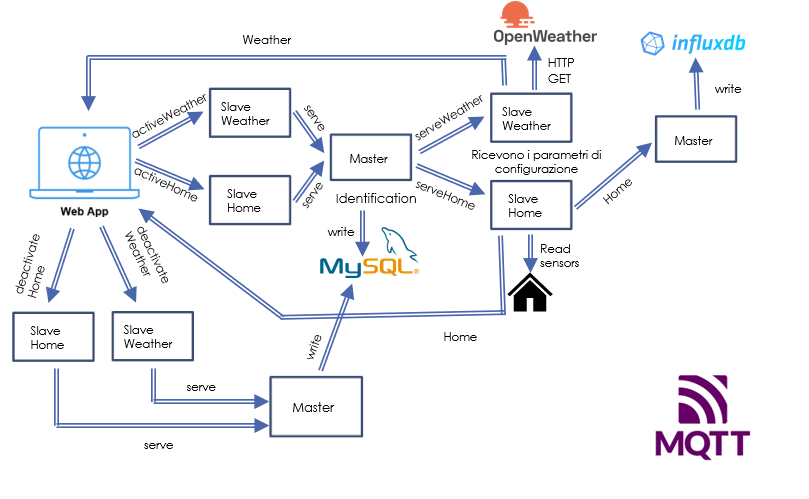

## Project:

The idea is to build an adaptive sensor network that is aware of the arrival of a new node in the network. Each new node is based on a NodeMCU (esp8266).
Since I only have one NodeMCU available, I need to simulate the presence of three nodes (master, home and weather). The master node is already registered in the sensor network while the slaves have to be dynamically added to the sensor network. The communication of the sensor network is handled using MQTT. The master node can act as the root user of the sensor network: it can collect messages from all nodes in the network and can log these messages to the database.

